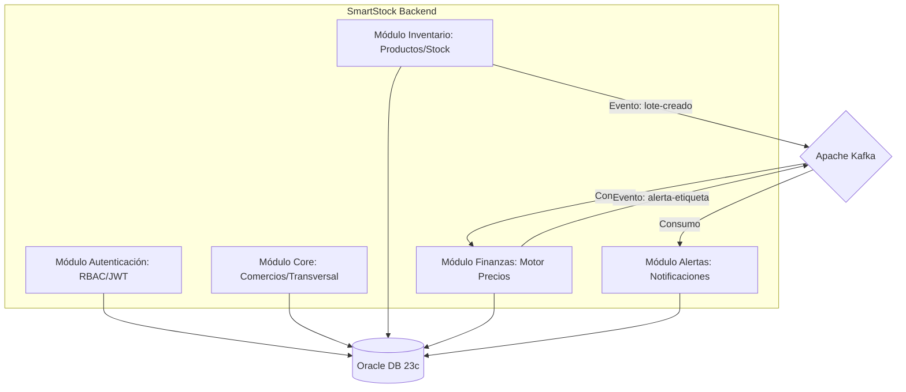
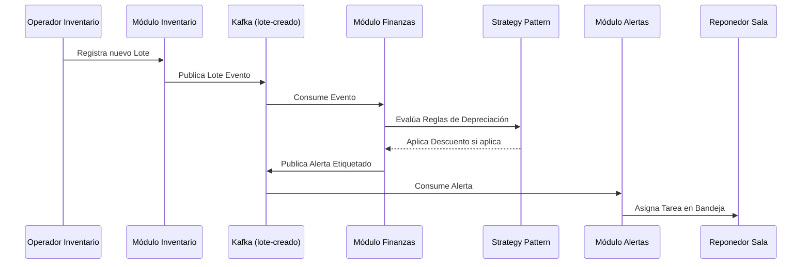

# 🏗️ SmartStock - Arquitectura de Gestión de Inventario Inteligente

SmartStock es una solución de backend empresarial diseñada bajo el paradigma de **Monolito Modular**, optimizada para el aislamiento lógico de múltiples comercios (**Multi-tenancy**) y la automatización reactiva de procesos mediante **Apache Kafka**.

---

## 🗺️ Mapa de Arquitectura

El sistema utiliza una arquitectura orientada a dominios (Domain-Driven Design simplificado) que permite el desacoplamiento de la lógica de negocio y facilita la escalabilidad horizontal de los servicios críticos.

### Diagrama de Módulos (C4 Level 2)


---

## 🚀 Flujo de Negocio: Motor de Precios Dinámicos

El flujo más crítico del sistema es el ajuste automático de precios por proximidad de vencimiento, el cual se resuelve de forma asíncrona:

### Diagrama de Secuencia


---

## 🛠️ Stack Tecnológico Pro y Patrones

### Backend Core
- **Java 17 / 25:** Uso de registros, Records y nuevas APIs de colecciones.
- **Spring Boot 3.4.1:** Ecosistema completo (Data, Security, Actuator).
- **Oracle JDBC + HikariCP:** Gestión profesional de pool de conexiones.

### Patrones de Diseño Aplicados
1.  **Monolito Modular:** Aislamiento de paquetes para evitar el "Big Ball of Mud".
2.  **Strategy Pattern:** Implementado en el `MotorPreciosService` para permitir múltiples tipos de cálculos de descuento (Proximidad, Volumen, Liquidación) sin modificar el núcleo del servicio.
3.  **Builder Pattern:** Utilizado en todas las entidades y DTOs para una construcción de objetos inmutable y legible.
4.  **Global Exception Handler:** Centralización del control de errores con respuestas estandarizadas.
5.  **Multi-tenant por Aislamiento Lógico:** Cada registro está vinculado a un `id_comercio`, filtrado estrictamente en la capa de persistencia y servicios.

---

## 👥 Control de Accesos (RBAC) y Jerarquías

El sistema impone reglas estrictas de creación de usuarios para mantener la integridad del comercio:

| Rol | Alcance | Responsabilidad |
| :--- | :--- | :--- |
| **ADMIN_SISTEMA** | Global | Crea Comercios y Gerentes de Tienda. |
| **GERENTE_TIENDA** | Local | Crea Operadores y Reponedores para su propia tienda. |
| **OPERADOR_INVENTARIO** | Operativo | Registra lotes y controla ingresos físicos. |
| **REPONEDOR_SALA** | Operativo | Ejecuta cambios de precio físico y atiende alertas. |

---

## 📡 Infraestructura de Eventos (Kafka)

### Tópicos Configurados
- `lote-creado`: Notifica a Finanzas la entrada de stock para evaluación de precios.
- `alerta-etiqueta`: Notifica a Alertas la necesidad de intervención física en sala.

---

## 📦 Guía de Instalación y Despliegue

### Configuración de Base de Datos (Oracle)
El sistema está configurado para conectarse a Oracle mediante perfiles:
- **Local:** Conexión TCP simple a Docker.
- **Producción:** Conexión segura mTLS utilizando Oracle Wallet (directorio `wallet/`).

### Ejecución con Docker
```bash
# Iniciar Oracle DB y Kafka KRaft
docker-compose up -d

# Compilar y ejecutar la app (Perfil Local)
mvn clean install
java -jar target/smartstock-backend.jar --spring.profiles.active=local
```

---

## 📖 Documentación de API (OpenAPI)

La documentación técnica detallada de cada endpoint está disponible vía Swagger UI:
🔗 `http://localhost:8080/swagger-ui.html`

### Headers de Seguridad Obligatorios
- `Authorization`: `Bearer <JWT>`
- `X-Comercio-ID`: Requerido para todas las operaciones locales.

---

## 🛡️ Estándar de Errores (RFC 7807)

Todas las respuestas de error siguen el siguiente formato JSON:
```json
{
  "timestamp": "2026-06-21T00:42:00",
  "status": 403,
  "message": "El Gerente solo puede crear roles OPERADOR_INVENTARIO o REPONEDOR_SALA.",
  "path": "/api/v1/usuarios"
}
```

---
© 2026 SmartStock - Architecture & Software Design Group.
